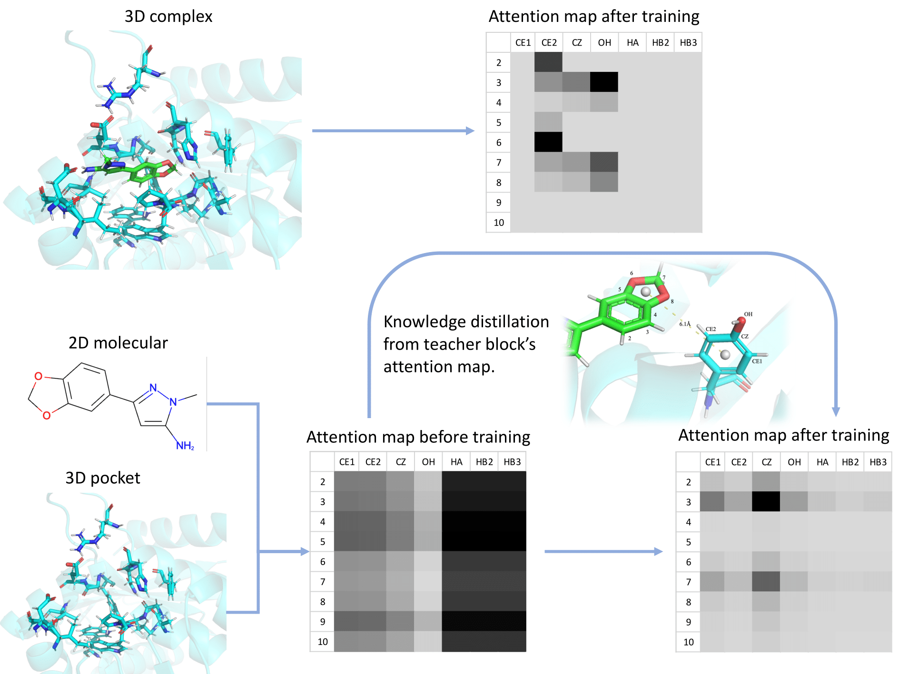

### Code for under review paper "Improving Drug-Target Affinity Prediction via Fusion Features and Knowledge Distillation"

##### Data Prepare

0. Download `pdbbind_v2016_general-set-except-refined.tar.gz`
            `pdbbind_v2016_refined.tar.gz`
            `PDBbind_v2020_other_PL.tar.gz`
            `PDBbind_v2020_refined.tar.gz` from `http://www.pdbbind.org.cn/download.php`

1. Run `python3 fix_sdf.py` to fix wrong molecular structures.
2. Run `python3 extract_pocket.py` to extract protein pocket.
3. Run `python3 preprocessing.py` to generate the training data.

##### Training

`python3 train.py`

##### Testing

`python3 test.py`

##### Test sample
Coming soon.
`python3 test_sample.py --pocket=pocket.pdb --ligand=ligand.sdf`
